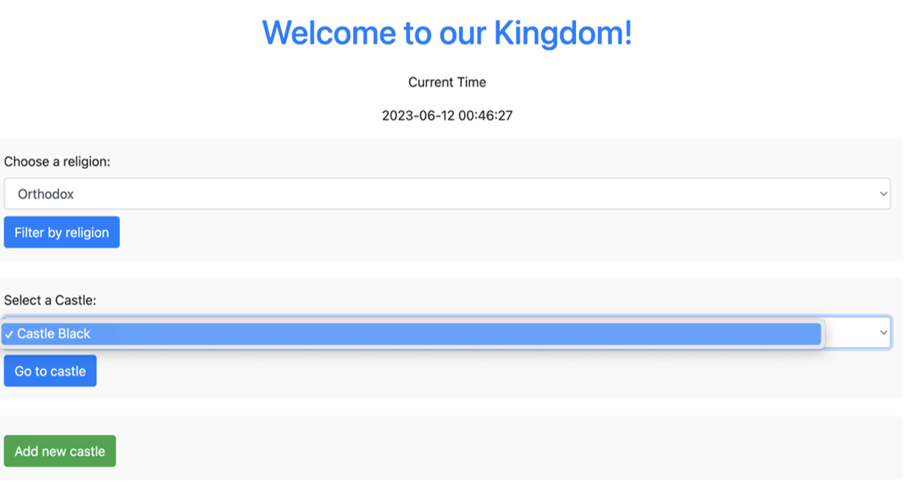
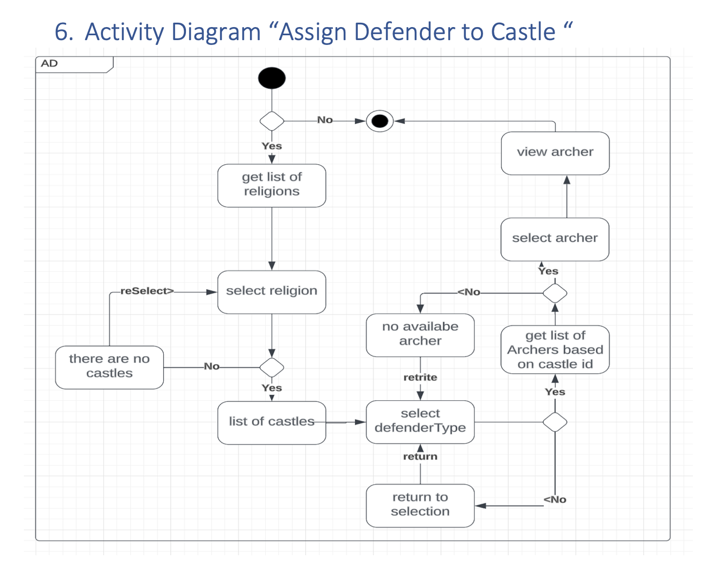
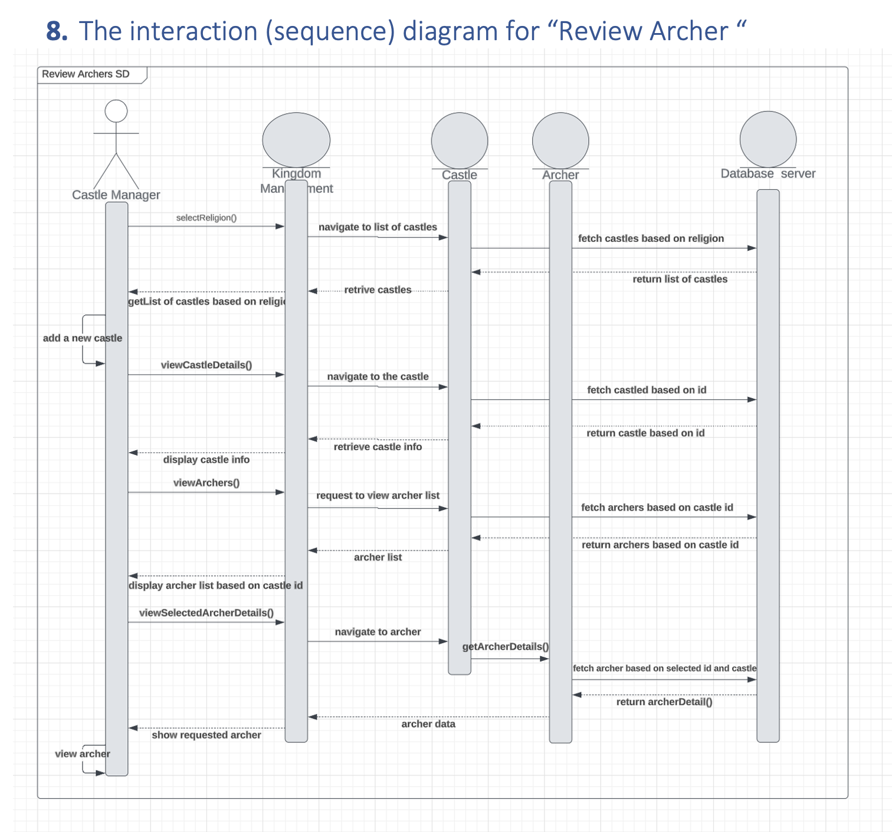

# Kingdom Management System

The Kingdom Management System is a comprehensive application that allows castle managers to efficiently manage various aspects of their castles. This system provides a user-friendly interface for managing castles, including defense strategies, spiritual affairs, stables, and gardens.

## User Requirements

The system provides the following functionalities:

1. View castle details, including the castle's ID, name, number of towers, and inner area.
2. Add new defenders (Archers or GateHolders) to augment a castle's defense.
3. Manage defenders for each castle individually, including viewing defender details and adding new defenders.
4. Manage balistarias for each castle, view their details, and add new balistarias.
5. Manage chapels for each castle, view chapel details, and manage clergy members.
6. Manage stables, view stable details, and add new stables (Traditional Stable or Barn).
7. Manage gardens, view garden details, and add new gardens (Royal Garden or Public Garden).

## Scenario: Assign Defender to Castle

### Use Case: View Defender

**Actors:**
- Castle Manager

**Purpose and Context:**
A castle manager wants to view the details of a specific defender assigned to a castle. The defenders can be an Archer or a GateHolder.

**Assumptions and Pre-conditions:**
1. The castle manager is logged into the system.
2. A defender has already been assigned to the castle.

**Basic Flow of Events:**
1. The castle manager selects the castle to manage.
2. The castle manager navigates to the defender management section on the castle details page.
3. The castle manager selects a defender type (Archer or GateHolder) from the dropdown menu.
4. The dropdown menu of defenders is enabled based on the selected defender type and castle ID.
5. The castle manager selects a specific defender from the dropdown menu.
6. The castle manager clicks the "Go to Defender" button.
7. The system redirects the castle manager to the detail page of the selected defender, displaying all the information related to that defender.

**Alternative Flows of Events:**
If no defender of the selected type (Archer or GateHolder) is available or assigned to the castle, the dropdown menu remains disabled, and the castle manager is prompted to add a new defender or assign an existing one.

## Design Decisions

1. Class Hierarchy and Inheritance: The system utilizes class inheritance to model different types of defenders (Archers and GateHolders). The Defender class serves as the abstract superclass, while the Archer and GateHolder classes inherit from it to encapsulate unique characteristics and functionalities.

2. Entity Relationships: The relationships between entities reflect the structure and functionality of a castle. The Castle entity has OneToMany relationships with Defender, Balistaria, and Chapel entities, allowing a single castle to house multiple instances of these entities.

3. Data Annotations: Data constraints and annotations have been applied to enforce data integrity and business rules. For example, the Castle class utilizes annotations like @NotNull, @Min, and @Max to validate the number of towers and ensure valid data entry.

4. Castle Class Design: The Castle class serves as the central entity in the system, containing information about physical aspects (number of towers, inner area) and logistical data (stored food). This design decision provides a comprehensive view of a castle's state and resources.

## Effect of Dynamic Analysis

The dynamic analysis process had the following effects on the system:

1. Performance Improvements: Dynamic analysis highlighted performance bottlenecks, leading to optimizations such as lazy loading of related entities to enhance system performance.

2. Runtime Error Handling: Potential runtime errors were identified and addressed through the implementation of data validation annotations (e.g., @NotNull) and data consistency checks to prevent null pointer exceptions.

3. Concurrency Control: Dynamic analysis revealed potential issues related to concurrent access to shared resources. The design was refined to ensure concurrent modifications (e.g., adding new defenders or assigning guard duty) do not lead to conflicts or inconsistent system states.

---

This README provides an overview of the Kingdom Management System.
Feel free to explore the system and manage your castles efficiently!
